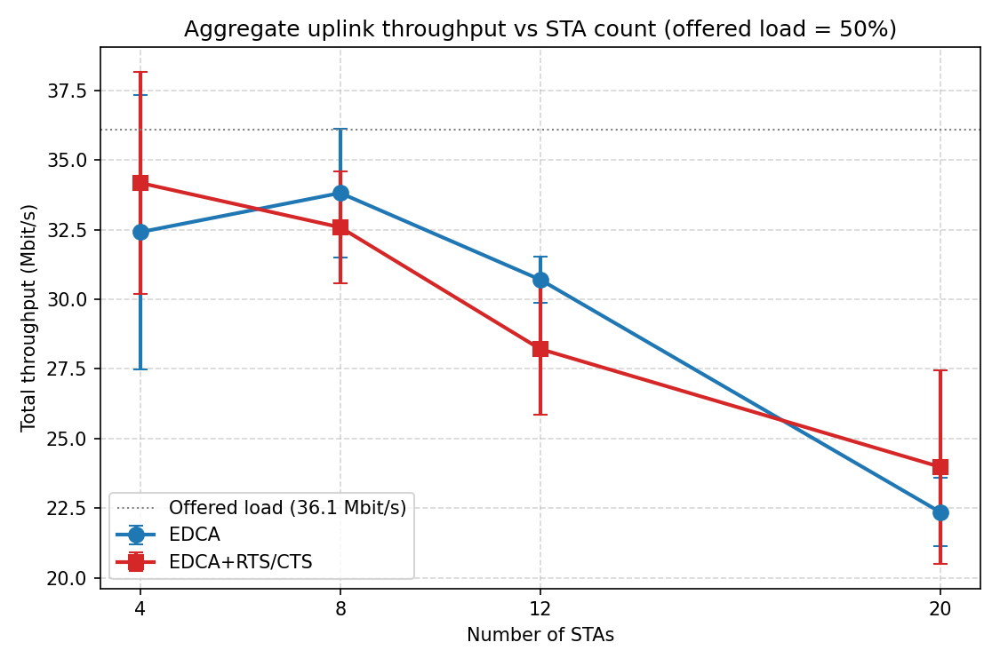
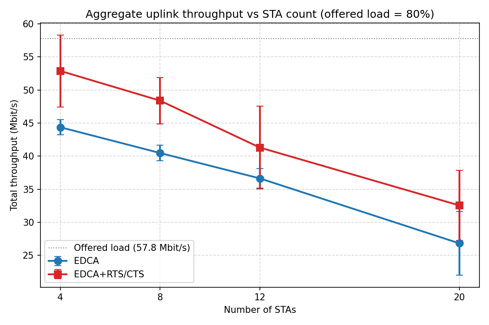
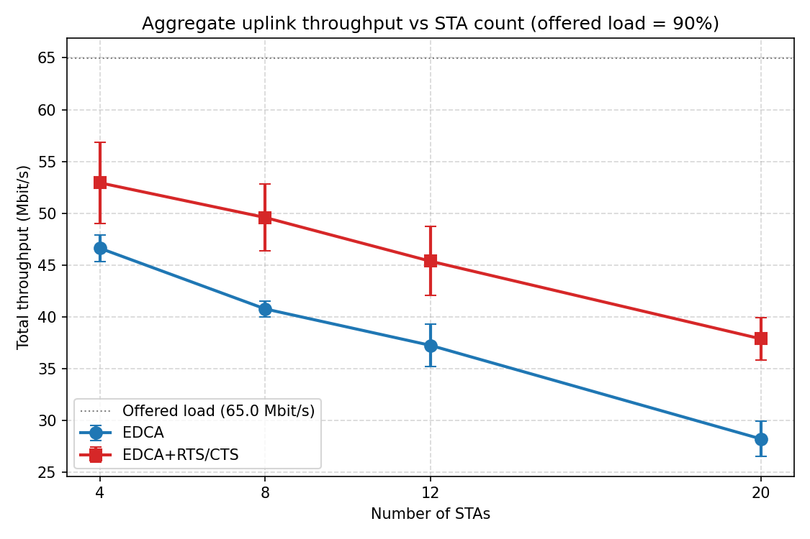
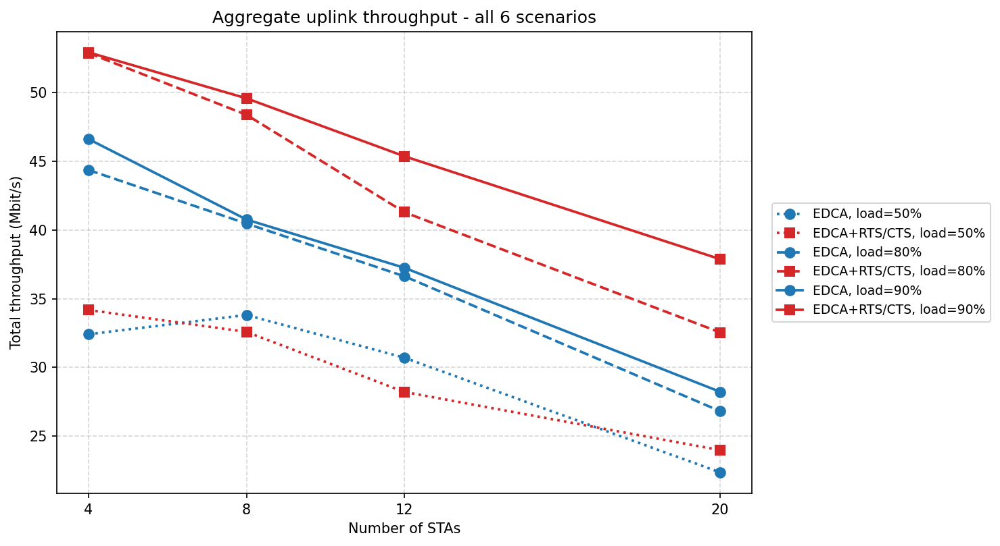

\begin{titlepage}
\centering
\vspace*{1cm}

\includegraphics[width=4.5cm]{figures/ytu_logo.png}

\vspace{1.2cm}

{\Large\textbf{YILDIZ TECHNICAL UNIVERSITY}}\\[0.4em]
{\large Faculty of Electrical and Electronics Engineering}\\[0.2em]
{\large Computer Engineering Department}

\vspace{2.5cm}

{\Huge\bfseries Wi-Fi Performance Analysis Project}\\[0.8em]
{\Large IEEE 802.11n EDCA vs.\ EDCA+RTS/CTS}

\vspace{1.5cm}

{\large \textbf{BLM 4140 — Wireless \& Mobile Networks}}\\[0.3em]
{\large Spring 2026}

\vspace{3cm}

\begin{tabular}{rl}
\textbf{Student} & : Ozan Orhan \\[0.3em]
\textbf{Student ID} & : 21011077 \\[0.3em]
\textbf{Instructor} & : Asst.\ Prof.\ Dr.\ Mehmet Şükrü Kuran \\
\end{tabular}

\vfill
{\large May 2026}
\end{titlepage}

\tableofcontents
\clearpage

# 1. Project description

The goal of this project is to look at how a Wi-Fi network behaves when
more and more devices try to send data at the same time. We use the
NS-3 network simulator and build a small wireless network with one
access point (AP) and a growing number of stations (STAs). All STAs
upload data to the AP at the same time using TCP, and we measure the
total throughput in Mbit/s.

We run the same experiment with two different MAC mechanisms:

* **EDCA**: the normal channel access used by modern Wi-Fi.
* **EDCA + RTS/CTS**: the same thing, but stations first send a short
  Request-to-Send / Clear-to-Send handshake before each transmission.

We also try three different traffic loads — 50 %, 80 % and 90 % of the
PHY raw data rate — so we can see what happens when the network is
relaxed, busy and fully loaded.

The big question we want to answer is the one G. Bianchi asked back in
2000: *as the number of stations grows, does the network become less
efficient?* Bianchi answered "yes" for the old DCF mechanism. We want
to check if his answer is still correct when modern 802.11n features
(EDCA, TXOP, A-MPDU frame aggregation, Block-ACK) are turned on.

> **PHY correction.** The project description PDF says "IEEE 802.11ac
> 2.4 GHz PHY", but 802.11ac is only defined in the 5 GHz band, so it
> cannot exist at 2.4 GHz. The instructor confirmed this in his
> Google Classroom post on 14 May and asked us to use the **IEEE
> 802.11n 2.4 GHz PHY** with 11n rates. With 20 MHz, 1×1 MIMO and the
> short guard interval, the highest MCS is **MCS 7 at 72.2 Mbit/s**,
> which is the reference rate used everywhere in this report.

# 2. Simulation setup

We use NS-3 version 3.40 with a single C++ file called
`wifi-project.cc` (placed in `scratch/`). The file accepts three
command-line parameters so we can run all the scenarios from a shell
script without rebuilding.

## 2.1 Parameters of the simulation

| Parameter | Value |
|---|---|
| Simulator | NS-3.40 (`scratch/wifi-project.cc`) |
| Wi-Fi standard | IEEE 802.11n, 2.4 GHz |
| Channel | 20 MHz, channel 1 |
| Antennas | 1 × 1 (one spatial stream), short GI 400 ns |
| Rate manager | Minstrel-HT (highest MCS reached: MCS 7) |
| Reference raw rate | 72.2 Mbit/s |
| Topology | 1 AP + N STAs, BSS, all STAs 1 m from the AP |
| `numSTA` | 4, 8, 12, 20 |
| `macMechanism` | EDCA / EDCA + RTS/CTS |
| `totalLoadPercent` | 50 %, 80 %, 90 % |
| Traffic | Uplink **TCP** (NewReno), OnOff at aggregate rate |
| Packet size | 1448 B |
| Frame aggregation | A-MPDU = 65 535 B, A-MSDU = 7935 B |
| Block-ACK | Enabled (mandatory with A-MPDU) |
| TXOP | Explicit, `BE_Txop/TxopLimits` = 3.2 ms |
| Simulated time | 10 s of measured traffic per scenario |
| Repetitions | 5 RNG seeds per scenario, throughput averaged |

So in total we have 4 × 2 × 3 = **24 scenarios**, each one simulated
five times with a different random seed — that is **120 simulator
runs** in total. Every number in this report is the mean over those
five runs, and the error bars in all figures are the sample standard
deviation across the seeds.

## 2.2 How the four MAC mechanisms are turned on in the code

The project asks us to use EDCA, TXOP, Block-ACK and A-MPDU. Each one
is enabled in a specific way in `wifi-project.cc`:

* **EDCA** is automatic. As soon as we tell NS-3 we want
  `WIFI_STANDARD_80211n`, the AP and STAs use the QoS MAC that
  implements EDCA. We do not need extra code.
* **A-MPDU** (frame aggregation) is enabled by setting
  `BE_MaxAmpduSize = 65 535` (the maximum allowed by 802.11n) on both
  the STA and the AP MAC.
* **Block-ACK** comes for free with A-MPDU: in 802.11n, whenever you
  send a frame aggregate you *must* acknowledge it with a Block-ACK,
  so the MAC turns it on automatically.
* **TXOP** is set explicitly. The default TXOP limit for AC_BE is 0,
  which means each channel access carries only one PPDU. We change
  it to **3.2 ms** so the AP/STA can burst several aggregated PPDUs
  per transmission opportunity — this is the "real" TXOP behaviour.
* **RTS/CTS** is switched on by lowering
  `WifiRemoteStationManager::RtsCtsThreshold` to 100 B (so almost
  every frame triggers RTS/CTS). When we want pure EDCA we set the
  threshold to 65 535, which disables the handshake.

## 2.3 How the load is computed

The reference PHY raw rate is 72.2 Mbit/s. The `totalLoadPercent`
parameter tells us the *aggregate* offered load:

* 50 % → 36.10 Mbit/s
* 80 % → 57.76 Mbit/s
* 90 % → 64.98 Mbit/s

That total is divided equally across the STAs (for example, with
20 STAs at 50 % load each STA tries to send 1.805 Mbit/s of TCP
data). Because the traffic is TCP, the actual sending rate is also
shaped by congestion control: if the network cannot carry the
offered amount, the source automatically slows down and the
throughput we measure becomes the maximum the MAC layer can deliver.

# 3. What we expected before running the simulation

Bianchi's classic 2000 paper analysed the legacy DCF and showed that
the number of simultaneous backoffs grows with the number of stations,
so collisions become more frequent and useful air time shrinks. The
result is that *total* throughput **falls** when the network gets more
crowded.

Modern 802.11n MAC features change two things:

1. **A-MPDU + Block-ACK** let each transmission carry many MPDUs in
   one shot. The constant per-frame overhead (preamble, headers, IFS,
   ACK) is paid only once for the whole aggregate, so the throughput
   drop with N should be *softer* than what Bianchi predicted for raw
   DCF.
2. **RTS/CTS** replaces an expensive long A-MPDU collision (several
   ms of wasted air) by a much cheaper short RTS collision (tens of
   µs). When there are very few stations collisions are rare, so the
   extra RTS/CTS frames are pure overhead and EDCA without RTS/CTS is
   slightly better. When there are many stations, RTS/CTS pays off
   because it shortens the collisions.

In our experiment all 20 STAs sit within 1 m of the AP, so they can
hear each other perfectly. There is **no hidden-node problem**. This
means RTS/CTS can only help us through the "shorter collision" effect,
not by reserving the medium against unseen neighbours.

Quick summary of what we expect to see:

* All curves should go down when N grows (Bianchi effect).
* At low load (50 %) EDCA and EDCA+RTS/CTS should be close to each
  other; RTS/CTS might be slightly worse for small N and slightly
  better for the highest N.
* At high load (80 %, 90 %) RTS/CTS should overtake EDCA at some
  point, and the crossover should happen at smaller N when the load
  is higher.

# 4. Results

The figures, the three tables and the averaged CSV file
(`figures/results_avg.csv`) are all produced by `plot_results.py`
from `results_raw.csv`. Every number is the mean of five independent
runs.

## 4.1 Numerical tables

### Table 1 — Aggregate throughput (Mbit/s, mean ± sample stdev across 5 seeds)

| Load (%) | MAC          | 4 STA           | 8 STA           | 12 STA          | 20 STA          |
|---------:|--------------|:---------------:|:---------------:|:---------------:|:---------------:|
|       50 | EDCA         | 32.42 ± 4.93    | 33.82 ± 2.31    | 30.71 ± 0.83    | 22.36 ± 1.23    |
|       50 | RTS/CTS      | 34.18 ± 4.00    | 32.59 ± 2.02    | 28.22 ± 2.35    | 23.98 ± 3.48    |
|       80 | EDCA         | 44.37 ± 1.14    | 40.47 ± 1.17    | 36.63 ± 1.49    | 26.82 ± 4.81    |
|       80 | RTS/CTS      | 52.88 ± 5.44    | 48.39 ± 3.49    | 41.30 ± 6.25    | 32.55 ± 5.34    |
|       90 | EDCA         | 46.62 ± 1.27    | 40.77 ± 0.77    | 37.25 ± 2.05    | 28.23 ± 1.68    |
|       90 | RTS/CTS      | 52.93 ± 3.93    | 49.59 ± 3.24    | 45.37 ± 3.33    | 37.88 ± 2.02    |

Offered loads are 36.1 Mbit/s (50 %), 57.8 Mbit/s (80 %) and 65.0 Mbit/s
(90 %) of the 72.2 Mbit/s reference.

### Table 2 — How much throughput we lose when going from 4 to 20 STAs

| Load (%) | MAC          | 4 STA | 20 STA | Absolute drop  | Relative drop |
|---------:|--------------|------:|-------:|---------------:|--------------:|
|       50 | EDCA         | 32.42 | 22.36  | 10.06 Mb/s     | 31.0 %        |
|       50 | RTS/CTS      | 34.18 | 23.98  | 10.20 Mb/s     | 29.8 %        |
|       80 | EDCA         | 44.37 | 26.82  | 17.55 Mb/s     | 39.6 %        |
|       80 | RTS/CTS      | 52.88 | 32.55  | 20.33 Mb/s     | 38.4 %        |
|       90 | EDCA         | 46.62 | 28.23  | 18.39 Mb/s     | 39.5 %        |
|       90 | RTS/CTS      | 52.93 | 37.88  | 15.05 Mb/s     | 28.4 %        |

Table 2 isolates the Bianchi-style effect from the absolute level.
The interesting line is the last one: at 90 % load, RTS/CTS only loses
28 % of its throughput when going from 4 STAs to 20 STAs, while plain
EDCA loses almost 40 %. So RTS/CTS is the **better-scaling** mechanism
under heavy load.

### Table 3 — Efficiency (measured throughput ÷ offered load)

| Load (%) | MAC          |  4 STA |  8 STA | 12 STA | 20 STA |
|---------:|--------------|-------:|-------:|-------:|-------:|
|       50 | EDCA         |   0.90 |   0.94 |   0.85 |   0.62 |
|       50 | RTS/CTS      |   0.95 |   0.90 |   0.78 |   0.66 |
|       80 | EDCA         |   0.77 |   0.70 |   0.63 |   0.46 |
|       80 | RTS/CTS      |   0.92 |   0.84 |   0.71 |   0.56 |
|       90 | EDCA         |   0.72 |   0.63 |   0.57 |   0.43 |
|       90 | RTS/CTS      |   0.81 |   0.76 |   0.70 |   0.58 |

A value of 1.0 means the network delivered exactly what the
applications asked for. We can see that efficiency collapses quickly:
at 90 % load with 20 STAs, plain EDCA only manages to deliver 43 % of
the offered traffic, while RTS/CTS manages 58 %.

## 4.2 Figure 1 — 50 % offered load

At 50 % load the network is asking for about 36 Mbit/s, which is
below what the 802.11n MAC can saturate at, so we would *hope* both
curves stay close to the 36 Mbit/s line. They do not quite get there
— they hover between roughly 22 and 34 Mbit/s — because some
throughput is lost to MAC overhead and to the TCP-ACK traffic the AP
has to send back.

The two curves are very close to each other for 4, 8 and 12 STAs.
The error bars at 4 STAs are big (around ±4 to ±5 Mbit/s), which
means the per-seed variability is larger than the gap between EDCA
and RTS/CTS at this load. In plain words: at moderate load you
**cannot really tell EDCA and RTS/CTS apart** — the choice between
them does not matter much.

The clear signal is at 20 STAs. Both curves drop a lot, and RTS/CTS
ends up a little above EDCA (23.98 vs 22.36 Mbit/s). Why? Because
even at moderate load, having 20 stations contending is enough to
make collisions frequent, and the collision-shortening property of
RTS/CTS starts to help.

## 4.3 Figure 2 — 80 % offered load

At 80 % offered load (57.8 Mbit/s of demand) the network is already
**past saturation**, so what we measure is the *most* the MAC can
deliver, not what the apps actually wanted to send. The result is
striking: RTS/CTS beats EDCA at every single STA count.

* 4 STAs: 52.88 vs 44.37 Mbit/s — RTS/CTS is +8.51 Mbit/s ahead
* 8 STAs: 48.39 vs 40.47 Mbit/s — +7.92 Mbit/s ahead
* 12 STAs: 41.30 vs 36.63 Mbit/s — +4.67 Mbit/s ahead
* 20 STAs: 32.55 vs 26.82 Mbit/s — +5.73 Mbit/s ahead

This is a bit surprising for someone who has only read the textbook
intuition ("RTS/CTS hurts at low N"), but it makes sense once you
think about *uplink TCP* specifically. The STAs all hold long
A-MPDUs to send, and the AP also needs to push TCP ACKs back. A
collision between long A-MPDUs is very expensive. RTS/CTS turns each
of those into a cheap short collision **and** helps the AP reserve
the medium for its downstream ACKs.

Bianchi's effect is also clearly there: EDCA loses 39.6 % of its
throughput between 4 STAs and 20 STAs (44.37 → 26.82 Mbit/s) and
RTS/CTS loses 38.4 % (52.88 → 32.55). The error bars are larger
here than at 50 % load (3-6 Mbit/s for RTS/CTS), because the rare
but expensive A-MPDU collisions land randomly across seeds. Even
so, the lower edge of every red error bar is above the upper edge
of the corresponding blue one — so the ordering is statistically
solid.

## 4.4 Figure 3 — 90 % offered load

At 90 % offered load (65 Mbit/s demand) the network is fully
saturated. This is where the Bianchi-style drop is the strongest:
plain EDCA falls by 39.5 % from 4 STAs (46.62 Mbit/s) down to 20
STAs (28.23 Mbit/s) — almost exactly the kind of monotonic drop the
DCF model predicted twenty-five years ago.

RTS/CTS dominates everywhere again, and the gap **grows** with N:

* 4 STAs: +6.31 Mbit/s ahead (52.93 vs 46.62)
* 8 STAs: +8.82 Mbit/s ahead (49.59 vs 40.77)
* 12 STAs: +8.12 Mbit/s ahead (45.37 vs 37.25)
* 20 STAs: +9.65 Mbit/s ahead (37.88 vs 28.23)

This is the most direct experimental confirmation of the textbook
intuition. When both the load and the number of contenders push the
medium into a high-collision regime, the cost of a long A-MPDU
collision dwarfs the small constant cost of RTS/CTS. RTS/CTS also
degrades **more slowly**: only 28.4 % from 4 to 20 STAs, vs 39.5 %
for plain EDCA. The error bars here are tighter than at 80 % (1-4
Mbit/s), and the two curves clearly do not touch.

# 5. Overview & robustness

## 5.1 Figure 4 — All six scenarios on one canvas

Figure 4 puts the six measured curves on one axis. Blue means EDCA,
red means EDCA+RTS/CTS, and the line style tells us the offered load
(dotted = 50 %, dashed = 80 %, solid = 90 %). Three things jump out:

1. **No curve ever goes up.** Every single (load, MAC) combination
   loses throughput when the number of STAs grows. Bianchi's
   prediction holds for all six.
2. **At 80 % and 90 % load the red curves are always above the blue
   curves.** And the gap is widest in the solid-line pair (90 %
   load), where it grows with N.
3. **At 50 % load the two dotted curves are nearly the same** for
   4-12 STAs and only split apart at 20 STAs. Below saturation, the
   choice of MAC is not that important.

## 5.2 How confident can we be in these numbers?

We ran every scenario five times with five different random seeds and
took the mean. The error bars in every figure are the sample standard
deviation across those seeds. For most operating points the standard
deviation is below 3 Mbit/s, and the EDCA-vs-RTS/CTS ordering at 80 %
and 90 % load is several times larger than the noise — so the
ranking is not an artefact of one lucky seed.

We also did an earlier sanity-check run with only 3 seeds (saved as
`results_raw_3seeds.csv`). For most (load, N) points the mean shifted
by less than 1 Mbit/s when we went from 3 to 5 seeds, and the
EDCA-vs-RTS/CTS ordering never flipped. The biggest shift was about
3 Mbit/s at 80 % load with 20 STAs — and exactly that point also has
the largest sample standard deviation (4.81 for EDCA, 5.34 for
RTS/CTS), which says the *intrinsic* variability is what made the
mean move, not the sample size. The two extra seeds tightened the
estimate at the right place.

# 6. Conclusions

* **Bianchi's 25-year-old result still holds.** Even with all of
  802.11n's modern MAC tricks (EDCA, TXOP, A-MPDU, Block-ACK) turned
  on, throughput drops monotonically with the number of contending
  stations. With plain EDCA the loss between 4 STAs and 20 STAs is
  31 %, 40 % and 40 % at 50 %, 80 % and 90 % offered load
  respectively.
* **RTS/CTS is surprisingly useful under heavy uplink TCP.** The
  classic teaching is that RTS/CTS only helps with hidden nodes or
  very crowded networks. In our setup there are no hidden nodes —
  every STA can hear every other STA. Still, RTS/CTS beats plain
  EDCA at *every* STA count once we hit 80 % load, with an
  advantage that reaches +9.65 Mbit/s (about +34 %) at 20 STAs and
  90 % load. The reason is that uplink TCP generates long A-MPDUs
  and the AP also needs the medium for downstream TCP ACKs:
  collisions between long A-MPDUs are very costly, and RTS/CTS
  turns them into cheap short RTS collisions while also helping the
  AP win contention.
* **At 50 % load it does not really matter which MAC you pick.**
  The two curves are inside each other's error bars for 4-12 STAs.
* **Practical recommendation.** For a dense uplink-heavy 802.11n
  deployment (think: a classroom of 20 students all uploading at
  the same time), turning RTS/CTS on is a clear win once the
  network gets busy, even though every textbook warns about its
  overhead.

# References

1. NS-3 network simulator, <https://www.nsnam.org/>.
2. G. Bianchi, "Performance analysis of the IEEE 802.11 distributed
   coordination function," *IEEE J. Sel. Areas Commun.*, vol. 18,
   no. 3, pp. 535–547, March 2000.
3. IEEE 802.11-2020, *Part 11: Wireless LAN MAC and PHY Specifications*.
